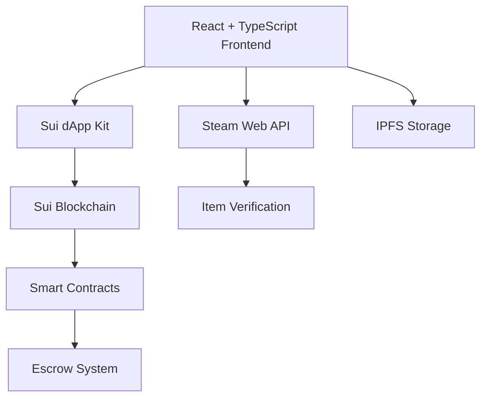

# Pudeez Frontend

> A cyberpunk-themed Steam marketplace built on the Sui blockchain, enabling secure peer-to-peer trading of Steam game items through smart contract escrows.

[](https://reactjs.org/)
[](https://www.typescriptlang.org/)
[](https://sui.io/)
[](https://vitejs.dev/)
[](https://expressjs.com/)
[](https://enoki.mystenlabs.com/)
[](https://www.sqlite.org/)
[](https://enoki.mystenlabs.com/)
[](https://www.walrus.xyz/)
## 🚀 Overview

Pudeez is a decentralized marketplace that bridges traditional Steam gaming with blockchain technology. Users can trade CS:GO, Dota 2, TF2, and other Steam game items using Sui blockchain's secure escrow system, ensuring safe and trustless transactions.

### Key Features

- **🎮 Steam Integration**: Direct connection to Steam inventory via OpenID
- **🔒 Secure Trading**: Blockchain-powered escrow protection
- **💎 Rare Items**: Trade discontinued and collectible Steam items
- **👥 Community Market**: Peer-to-peer trading marketplace
- **⚡ Zero Fees**: No platform fees for trading
- **🌐 Multi-Wallet Support**: zkLogin (Enoki) and external wallets

## 🏗️ Architecture

### Wallet Integration
We support two wallet types for maximum accessibility:

#### 1. zkLogin (Enoki)
- **Social Authentication**: Login with Google, Apple, or other providers
- **Gasless Transactions**: Sponsored transactions for better UX
- **Native Integration**: Seamless onboarding for new users

#### 2. External Wallets
- **Sui Wallet**: Official Sui wallet support
- **Third-party Wallets**: Compatible with Sui ecosystem wallets (e.g., Slush)
- **Hardware Wallets**: Support for Ledger and other hardware solutions

### Technology Stack



## 🛠️ Installation & Setup

### Prerequisites

- Node.js 18+ 
- pnpm (recommended) or npm
- Git

### Quick Start

```bash
# Clone the repository
git clone https://github.com/JaxChoong/Pudeez-Frontend.git
cd Pudeez-Frontend

# Install dependencies
pnpm install

# Set up environment variables
cp .env.example .env.local
# Edit .env.local with your configuration

# Start development server
pnpm dev
```
## 📱 Application Structure

### Page Routes

| Route | Component | Description |
|-------|-----------|-------------|
| `/` | LandingPage | Homepage with features and CTA |
| `/marketplace` | MarketplacePage | Browse and search Steam items |
| `/inventory` | InventoryPage | User's Steam inventory management |
| `/profile` | ProfilePage | User profile and Steam integration |
| `/cart` | CartPage | Shopping cart for batch purchases |
| `/escrow` | EscrowPage | Transaction monitoring dashboard |
| `/view/:assetId` | ItemDetailsPage | Detailed item information |
| `/buy/:assetId` | BuyPage | Purchase flow with Steam trade |
| `/sell/:assetId` | SellPage | List items for sale or auction |
| `/escrow/view/:transactionId` | EscrowViewPage | Detailed escrow transaction view |

### Component Architecture

```
src/
├── components/           # Reusable UI components
│   ├── ui/              # Base UI components (buttons, inputs, etc.)
│   ├── Navbar.tsx       # Main navigation
│   └── Shimmer.tsx      # Loading states
├── contexts/            # React contexts
│   ├── WalletProvider.tsx   # Wallet state management
│   └── SteamContext.tsx     # Steam integration context
├── hooks/               # Custom React hooks
│   ├── useImageLoading.ts   # Image loading states
│   └── useSuiTransaction.ts # Sui transaction handling
├── lib/                 # Utility functions
│   ├── suiClient.ts     # Sui blockchain client
│   └── utils.ts         # Helper functions
├── pages/               # Page components
└── services/            # API services
    └── marketplaceService.ts
```

## 🎯 User Flows

### 1. New User Onboarding
```
Landing Page → Sign Up → Steam Connection → Wallet Setup → Marketplace
```

### 2. Item Purchase
```
Marketplace → Item Selection → Buy Modal → Steam Trade Setup → Escrow Creation → Completion
```

### 3. Item Listing
```
Inventory → Select Item → Sell Page → Configure Listing → Blockchain Transaction → Live Listing
```

### 4. Escrow Management  
```
Escrow Dashboard → Filter Transactions → View Details → Monitor Progress → Completion
```

## 🔐 Security & Trust

### Escrow System
- **Smart Contract Protection**: Funds held in secure Sui smart contracts
- **Atomic Transactions**: All-or-nothing transaction execution
- **Dispute Resolution**: Built-in mechanisms for trade disputes
- **Transparent History**: All transactions recorded on-chain

### Steam Integration Security
- **OpenID Authentication**: Official Steam login system
- **Inventory Verification**: Real-time Steam API validation
- **Trade URL Validation**: Secure Steam trade link handling
- **Rate Limiting**: API call limits and caching

## 🔄 State Management

### Wallet State
```typescript
interface WalletState {
  currentAccount: SuiAddress | null;
  isConnecting: boolean;
  walletType: 'enoki' | 'external' | null;
  balance: string;
}
```

### Steam Integration
```typescript
interface SteamState {
  steamId: string | null;
  profile: SteamProfile | null;
  inventory: SteamItem[];
  selectedGame: GameInfo | null;
  isAuthenticated: boolean;
}
```

## 🛡️ API Constraints & Limits

### Steam Web API
- **Rate Limits**: 100,000 calls per day
- **Caching Strategy**: 5-minute cache for inventory data
- **Error Handling**: Graceful degradation for API failures
- **Backup Systems**: IPFS storage for critical data

### Sui Blockchain
- **Gas Optimization**: Batched transactions where possible
- **Transaction Limits**: Respectful of network congestion
- **Error Recovery**: Automatic retry mechanisms
- **State Synchronization**: Real-time blockchain event listening

## 🚧 Future Implementations

### Planned Features
- **🤖 AI Agent Identity**: Autonomous trading agents
- **🌍 Internationalization**: Multi-language support with react-i18next
- **🔍 ZK Proofs**: zkLogin integration for Steam OpenID verification
- **📊 Enhanced Analytics**: Advanced inventory tracking mechanisms
- **🔑 API Key Management**: Secure Steam Web API key handling

### Roadmap
- Q1 2025: AI Agent integration
- Q2 2025: Multi-language support
- Q3 2025: Advanced escrow features
- Q4 2025: Mobile app development

## 🧪 Testing

```bash
# Run unit tests
pnpm test

# Run integration tests
pnpm test:integration

# Run E2E tests
pnpm test:e2e

# Test coverage
pnpm test:coverage
```

## 📦 Build & Deployment

```bash
# Build for production
pnpm build

# Preview production build
pnpm preview

# Deploy to staging
pnpm deploy:staging

# Deploy to production
pnpm deploy:prod
```

## 🤝 Contributing

1. Fork the repository
2. Create your feature branch (`git checkout -b feature/amazing-feature`)
3. Commit your changes (`git commit -m 'Add amazing feature'`)
4. Push to the branch (`git push origin feature/amazing-feature`)
5. Open a Pull Request


## References
1. [SUI dApp Kit](https://sdk.mystenlabs.com/dapp-kit)
2. [smwug by builders-of-stuff](https://github.com/builders-of-stuff/smwug)
3. [Mysten Labs TypeScript SDK](https://sdk.mystenlabs.com/typescript)
4. [Mysten Labs SUI SDK](https://github.com/MystenLabs/sui)
5. [Enoki TypeScript SDK](https://docs.enoki.mystenlabs.com/ts-sdk)